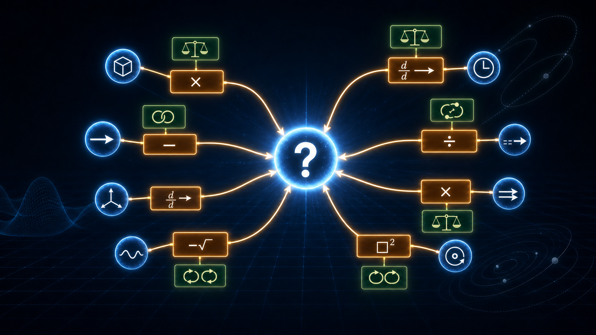

# Physics GNN Symbolic Discovery

> I see a physical world as a graph: quantities are nodes, equations and laws
> make the edges, and solving means finding a path from what is known to what is
> hidden.

This repository contains a self-auditing graph neural network for a closed,
synthetic classical-mechanics corpus. It learns to reconstruct missing
quantities from partial observations, probes distant nodes for candidate
relationships, and then requires a separate symbolic and prior-shift audit
before interpreting those relationships.

The project does **not** claim a new law of physics. In a corpus generated from
known equations, every valid relationship must be an encoded consequence. The
purpose of this stage is to test multi-path reasoning and build an audit strong
enough to reject false novelty before moving to real measurements.

**Paper:** [PDF](paper/physics_gnn_symbolic_discovery.pdf) ·
[LaTeX](paper/physics_gnn_symbolic_discovery.tex) ·
[stable DOI](https://doi.org/10.5281/zenodo.21984785) ·
[latest release](https://github.com/mi99at/physics-gnn-symbolic-discovery/releases/tag/v1.1.0)

## Try the equation-route challenge

[Open Physics Route Lab](https://physics-route-lab-minnatullah.ayan14.chatgpt.site):
hide measurements, inspect alternative routes to mass, force, momentum, or
kinetic energy, and report an assumption or calculation that needs review.
The page runs a small **symbolic solver, not the trained GNN**. Its calculation
steps are not evidence of the network's internal reasoning.

The [demo source and tests](demo/route-lab/README.md) are included here.
Help by [reproducing an archived result](REPRODUCIBILITY.md),
[checking physical assumptions](https://github.com/mi99at/physics-gnn-symbolic-discovery/issues),
or [contributing independent measurements](REAL_DATA_ROADMAP.md).
The [community launch kit](COMMUNITY_LAUNCH.md) includes draft communications
and a first-month contribution plan.

## The graph idea

The same hidden quantity can be reached through different physical routes. For
mass, examples include:

$$
m=F/a=p/v=2K/v^2=W/g=\rho V.
$$

Each route is valid only when its required observations and assumptions are
present. The implemented graph generalizes this idea across 159 shared
quantities.

| Graph element | Count | Information carried |
|---|---:|---|
| Quantity nodes | 159 | SI dimensions, rank, physical semantics, revealed value/sign or unknown token |
| Equation nodes | 131 | linear, quadratic, trigonometric, ratio, square-root, conservation, domain, and other form flags |
| Law nodes | 15 | kinematic, conservation, force-law, empirical, violability, and symmetry flags |
| Directed edges | 1,217 | operator, role, direction, sign, square, coefficient, and conjunction features |

Reverse equation edges let information travel backward through a relation, as
when force and acceleration are known but mass is hidden.

## Results at a glance

| Evidence | Result |
|---|---:|
| Scenario-consistent corpus | 650,000 worlds across 13 domains |
| Complete held-out ladder | 7,500 worlds; 1,500 per protected route |
| Archived GNN at epoch 40 | R² = 0.986–0.994 across L0–L4 |
| Near-parameter-matched flat MLP | Mean R² = 0.968, 0.925, 0.877, 0.870, 0.515 across L0–L4 (3 seeds) |
| Checkpoint intervention subset | 100 fixed examples per route |
| Candidate relationships screened and audited | 400 |
| Certified monomial consequences | 254 |
| Prior-sensitive artifacts | 33 |

The MLP has 1,916,637 parameters versus the GNN's 2,165,699. It is trained from
three independent seeds on the same 95/5 split and masking/ban protocol, but
receives no graph, node features, edge features, equations, laws, or scenario
identity. Checkpoints are selected by a fixed validation mask; the ladder is
evaluated once afterward.

The checkpoint interventions are deliberately labeled as diagnostics. Zeroing
SI or semantic node features, operator or role/direction edge features, edge
flags, or removing reverse edges can strongly degrade the already-trained
model, but this does not replace retraining every ablated architecture.

## Evidence map

- **Archived GNN run:** v9_history.json and the versioned checkpoint artifacts.
- **Node/edge diagnostics:** experiments/v1_1_checkpoint_ablations.json.
- **Three-seed non-graph baseline:** experiments/v1_1_flat_mlp_baseline.json.
- **Neural candidate screen:** discoveries_v1.json.
- **Matching symbolic/prior audit:** catalog_v1.json.
- **Claim boundaries and commands:** REPRODUCIBILITY.md.

The large arrays and checkpoints are distributed through the archival and
GitHub releases; their SHA-256 hashes are recorded in ARTIFACTS.md.

## Reproduce

Install the exact CPU environment used for the v1.1 diagnostics:

    python -m venv .venv
    .venv/Scripts/python -m pip install -r requirements-lock.txt

Verify every tracked result and checksum:

    .venv/Scripts/python scripts/validate_release.py

Re-run the checkpoint interventions:

    .venv/Scripts/python scripts/evaluate_checkpoint_ablations.py --per-ban 100 --batch-size 8

Re-run the near-capacity-matched baseline:

    .venv/Scripts/python scripts/train_flat_mlp_baseline.py --epochs 5 --seeds 7 17 29 --hidden 768 --batch-size 2048

The full GNN run is GPU-oriented. The original command remains:

    python gnn_trainer_v9.py

Independent seed directories are pre-wired for a future full retraining study:

    python scripts/run_gnn_multiseed.py --seeds 7 17 29 43 71 --epochs 60

See [REPRODUCIBILITY.md](REPRODUCIBILITY.md) for evidence classes, environment,
selection policy, and claim boundaries.

## From Bihar to real data

Md Minnatullah is an independent researcher from Supaul, Bihar, India. Coming
from a low-income family without access to a conventional laboratory or
research funding, he began with a synthetic benchmark and ordinary computing
resources. His long-term mission is to teach AI to reason across physics deeply
enough to help humans find genuinely new relationships, while requiring every
candidate to survive symbolic and empirical audit.

The next stage is not a larger synthetic claim. It is real data with noise,
calibration, hidden variables, hard splits, and external replication. The
[real-data roadmap](REAL_DATA_ROADMAP.md) begins with a low-cost phone pendulum
experiment, then public JPL orbital data and NIST materials measurements.

## Publication and outreach

- Stable archive for all versions: https://doi.org/10.5281/zenodo.21984785
- Author ORCID: https://orcid.org/0009-0001-6750-791X
- GitHub releases: https://github.com/mi99at/physics-gnn-symbolic-discovery/releases
- Responsible summaries and collaboration text: [PUBLICITY_KIT.md](PUBLICITY_KIT.md)
- Reproduction or collaboration guidance: [CONTRIBUTING.md](CONTRIBUTING.md)

The current arXiv submission remains subject to arXiv's category-endorsement
process. The DOI archive and GitHub release are the public, citable records
while that process is pending.

## Citation

Please use the metadata in [CITATION.cff](CITATION.cff). For a long-lived link
that always resolves to the newest version, cite the concept DOI:

> Md Minnatullah (2026). *Physics GNN Symbolic Discovery: A Self-Auditing Graph
> Neural Network for Classical Mechanics*. Zenodo.
> https://doi.org/10.5281/zenodo.21984785

## License

Code is available under the MIT License. The paper, generated data, model
checkpoints, and research/publicity assets are available under CC BY 4.0; see
[LICENSE-DATA.md](LICENSE-DATA.md).
